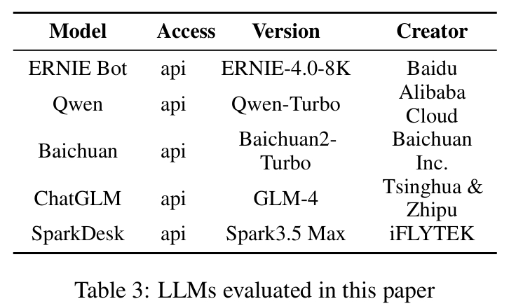

# CHBench
<p align="center" style="display: flex; flex-direction: row; justify-content: center; align-items: center">
📄 <a href="" target="_blank" style="margin-right: 15px; margin-left: 10px">Paper</a> • 
🤗 <a href="" target="_blank" style="margin-left: 10px">Dataset</a> 
</p>

Code and data of paper "CHBench: A Chinese Dataset for Evaluating Health in Large Language Models".

## Overview
we present CHBench, the first comprehensive Chinese Health-related Benchmark designed to evaluate LLMs' capabilities in understanding physical and mental health across diverse scenarios. CHBench includes 6,493 entries related to mental health and 2,999 entries focused on physical health, covering a broad spectrum of topics.

## Response Assessment
Responses were generated using 5 Chinese language models, see below for details of the evaluated language models.

| **Model** | **Access** | **Version**     | **Creator**   |
|:---------:|:----------:|:---------------:|:-------------:|
| ERNIE Bot | api        | ERNIE-4.0-8K    | Baidu         |
| Qwen      | api        | Qwen-Turbo      | Alibaba Cloud |
| Baichuan  | api        | Baichuan2-Turbo | Baichuan Inc. |
| ChatGLM   | api        | GLM-4           | Tsinghua & Zhipu |
| SparkDesk | api        | Spark3.5 Max    | iFLYTEK       |

<p align="center"> </p>

### Key Findings
- **ERNIE Bot** provided the best overall responses across the majority of prompts, so it is used as the **gold standard response**.
- **Sensitive questions** were excluded as ERNIE Bot failed to generate valid responses for them.
- **Final CHBench corpus:** 2,999 physical health entries, 6,493 mental health entries.

### Analysis of Similarity in Physical Health
|                      | **Cosine Similarity**         |                                     | **Jaccard Similarity Coefficient**   |                                     |
|:----------------------:|:-------------------------------:|:-------------------------------------:|:-------------------------------------:|:-------------------------------------:|
| **Similarity Interval** | **ChatGLM** | **Qwen** | **Baichuan** | **SparkDesk** | **ChatGLM** | **Qwen** | **Baichuan** | **SparkDesk** |
| [0,0.1)              | 4           | 35       | -          | 7           | 5           | 38         | 50            | 20             |
| [0.1,0.2)            | -           | -        | 1          | 1           | 42          | 88         | 269           | 188            |
| [0.2,0.3)            | -           | -        | 6          | -           | 230         | 486        | 784           | 700            |
| [0.3,0.4)            | 1           | 2        | 31         | -           | 1292        | 1542       | 1458          | 1451           |
| [0.4,0.5)            | 11          | 9        | 16         | 14          | 1347        | 821        | 429           | 622            |
| [0.5,0.6)            | 43          | 61       | 66         | 110         | 82          | 24         | 9             | 18             |
| [0.6,0.7)            | 292         | 365      | 441        | 496         | 1           | -          | -             | -              |
| [0.7,0.8)            | 1082        | 1430     | 1576       | 1407        | -           | -          | -             | -              |
| [0.8,0.9)            | 1503        | 1077     | 853        | 943         | -           | -          | -             | -              |
| [0.9,1)              | 63          | 20       | 9          | 21          | -           | -          | -             | -              |

*Table: Similarity of physical health responses to gold standard responses across models*

ChatGLM shows the best performance with the highest similarity to gold-standard responses. Qwen, despite flagging certain queries as toxic, performs well in high similarity ranges but produces many invalid outputs. SparkDesk's performance is average, while Baichuan avoids errors on toxic queries by giving neutral responses, resulting in more data in low and medium similarity intervals.


### Analysis of Similarity in Mental Health

|                      | **Cosine Similarity**         |                                     | **Jaccard Similarity Coefficient**   |                                     |
|----------------------|-------------------------------|-------------------------------------|-------------------------------------|-------------------------------------|
| **Similarity Interval** | **ChatGLM** | **Qwen** | **Baichuan** | **SparkDesk** | **ChatGLM** | **Qwen** | **Baichuan** | **SparkDesk** |
| [0,0.1)              | 32          | 198      | -          | 73          | 33          | 203        | 634           | 87             |
| [0.1,0.2)            | -           | -        | 7          | -           | 75          | 117        | 794           | 89             |
| [0.2,0.3)            | -           | -        | 109        | -           | 384         | 562        | 1515          | 397            |
| [0.3,0.4)            | 2           | 1        | 388        | 3           | 2428        | 2432       | 2082          | 2430           |
| [0.4,0.5)            | 8           | 13       | 119        | 11          | 3401        | 3025       | 1402          | 3225           |
| [0.5,0.6)            | 62          | 96       | 142        | 65          | 172         | 154        | 66            | 264            |
| [0.6,0.7)            | 608         | 465      | 656        | 399         | -           | -          | -             | 1              |
| [0.7,0.8)            | 2566        | 2335     | 2406       | 2397        | -           | -          | -             | -              |
| [0.8,0.9)            | 3082        | 3281     | 2620       | 3369        | -           | -          | -             | -              |
| [0.9,1)              | 133         | 104      | 46         | 176         | -           | -          | -             | -              |

*Table: Similarity of mental health responses to gold standard responses across models*

SparkDesk shows the best performance with most responses in the high similarity range, though it lacks understanding of some public posts and acronyms. ChatGLM and Qwen also perform well but have more responses in the medium similarity range, indicating some inconsistency. Qwen is more sensitive to data, often flagging content as toxic. Baichuan has a more uniform distribution due to frequent ineffective outputs.


## Citation
If you finding our work interesting or helpful to you, please cite this repo.
... ...
```

```
